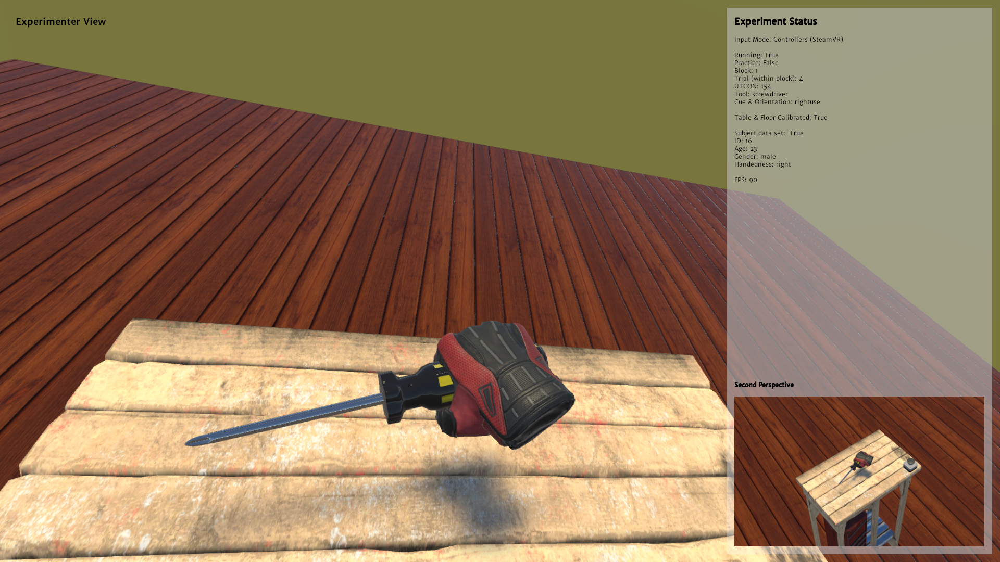

&nbsp;

A virtual reality experiment to investigate the influence of tool knowledge on anticipatory eye fixations featuring eye tracking, LeapMotion hand tracking and SteamVR controller support. 

SteamVR controllers        |  LeapMotion hand tracking
:-------------------------:|:-------------------------:
  |  

&nbsp;

### Prerequisites 

In order to run the experiment either from the build or from source the [LeapMotion SDK](https://developer.leapmotion.com/sdk-leap-motion-controller/) as well as the [ViveSR runtime](https://developer.vive.com/resources/vive-sense/sdk/vive-eye-tracking-sdk-sranipal/) need to be installed. They enable communication between the eyetracker/ LeapMotion hardware and the experiment. The code and build are tested with LeapMotion SDK version 4.0.0 and ViveSR runtime version 1.1.2.0. Additionally, [SteamVR](https://store.steampowered.com/app/250820/) needs to be installed. 

### Running the build 
A build of the experiment is available in the `Build` folder. In addition to the LeapMotion SDK and the ViveSR runtime, proper configuration files need to be present inside the `Configuration` folder in order to run the experiment. Default configuration files are provided. 

### Running from source 
The source Unity project can be found in the `Source` folder. For maximum compatibility, the same software revisions should be used, that were also used during development.  

- The project is realized with Unity version 2019.2.14f1 
- Additional APIs  
  - Present in this repository
    - [LeapMotion Unity modules](https://github.com/leapmotion/UnityModules), version 4.4.0 
    - [SteamVR plugin](https://github.com/ValveSoftware/steamvr_unity_plugin), version 2.5
  - Need to be installed manually (the target locations are marked in the `Assets` folder)
    - TextMesh Pro, version 2.0.1 (can be installed from the Unity Package Manager)
    - [ViveSR plugin from the Vive Eye Tracking SDK (SRanipal)](https://developer.vive.com/resources/vive-sense/sdk/vive-eye-tracking-sdk-sranipal/), version 1.1.0.1 

### Configuration 

Inside the `Configuration` folder, there are multiple files that control the experiment setup. Default files are provided. 
- **ExperimentUtcons.csv** holds the trial progression during the experiment. 'Utcon' is an acronym for 'unique tool cue orientation number' and thus precisely describes a trial's configuration. Custom trial progressions can be generated from within the experiment, specifying a seed and the number of trial blocks. The default ExperimentUtcons.csv is generated from seed 4 with 3 blocks. 
- **PracticeUtcons.csv** holds the trial progression during the practice section at the beginning of the experiment.
- **OrientationCueNamesIds.csv** holds a mapping from the positions of the tools' handles and the presented cues to unique numbers that are used in Utcons. 
- **ToolNamesIds.csv** holds a mapping from the tools' names to unique number that are also used in Utcons. 
- **ToolLeapConfig.ini** is the main configuration file of the experiment and holds diverse settings. 

### Starting a measurement 

In order to start a measurement, first, the room and the table the participant will sit at need to be calibrated in virtual space. The calibration can be started via the `Calibrate Floor & Table` option in the main menu of the experiment. The calibration files will be stored in the `Calibration` folder that is located in the root of the experiment's file hierarchy and can be reloaded at a later time. Second, the participant's information needs to be provided using the `Set Subject Data` option in the main menu. 
The measurement can then be started using `Start Experiment` from the main menu. 

### Third-party asset credits 

#### 3D models
Some of the used 3D models were obtained from online ressources. They are all licenced under a [creative commons attribution 4.0](https://creativecommons.org/licenses/by/4.0/).

- [Adjustable Spannerwrench](https://sketchfab.com/3d-models/adjustable-spannerwrench-e13f98a9d7364510a65042d4c42e7a9c) by [CGWorker](https://sketchfab.com/CGWorker)
- [Emergency Stop Button](https://sketchfab.com/3d-models/emergency-stop-button-012e4809a41445ca9de17286f677fabb) by [Miljan Bojovic](https://sketchfab.com/phoenix-storms)
- [Gardening Trowel](https://sketchfab.com/3d-models/gardening-trowel-e6b0caf5e23547d88ebb458a5980e9b6) by [Matthew Meyers](https://sketchfab.com/darthobsidian)
- [Hammer](https://sketchfab.com/3d-models/hammer-2faa70b89da743d2924670ffe7d80163) by [FlukierJupiter](https://sketchfab.com/FlukierJupiter)
- [Old Work Bench](https://sketchfab.com/3d-models/old-work-bench-9fbc30ba31a546fe9370e6de2dcc0707) by [Oliver Triplett](https://sketchfab.com/OliverTriplett)
- [Screw Driver](https://sketchfab.com/3d-models/phillips-head-screw-driver-78c516b16ecc4b12bb2e6d90d031596e) by [KleenStudio](https://sketchfab.com/brandonh111121)
- [Tableware](https://sketchfab.com/3d-models/low-poly-tableware-7e3aeb6622ce4672968d8cabbb63cbd3) by [Anthony Yanez](https://sketchfab.com/paulyanez)

#### Texture 

- The texture [Planks Brown 10](https://texturehaven.com/tex/?c=wood&t=planks_brown_10) by Rob Tuytel is licensed under the [CC0](https://creativecommons.org/publicdomain/zero/1.0/) license.

#### Sound

- The sound [Beep in C](https://freesound.org/people/Hydranos/sounds/237706/) by [Hydranos](https://freesound.org/people/Hydranos/) is licensed under the [CC0](https://creativecommons.org/publicdomain/zero/1.0/) license.

### Vive Eye Tracking SDK notice
Distribution of the plugins in object code form is permitted via the SDK license agreement. Running the build or the code as provided here will collect facial feature data of the user for the purpose of eye tracking and the eye tracking data will be stored on the user's local machine.

### API Licenses

Use of [Leap Motion's UnityModules](https://github.com/leapmotion/UnityModules) is subject to the [Apache V2 License Agreement](http://www.apache.org/licenses/LICENSE-2.0).
The [SteamVR Unity plugin](https://github.com/ValveSoftware/steamvr_unity_plugin) is licensed under the [BSD 3-Clause "New" or "Revised" License](https://github.com/ValveSoftware/steamvr_unity_plugin/blob/master/LICENSE).

